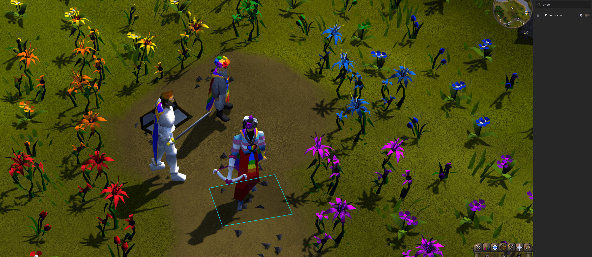

# UnPolledScape

UnPolledScape is a RuneLite external plugin focused on restoring selected
pre-unpolled behavior/game updates and presentation in Old School
RuneScape.

The plugin currently targets legacy-style NPC text and naming, character
customization UI wording/behavior, selected player-visual suppressions, and
specific game object adjustments.

## What This Plugin Does

At a high level, UnPolledScape can:

- Restore selected NPC names and dialogue/menu wording to legacy text.
- Restore legacy-style wording/controls in character creation and makeover
	interfaces.
- Suppress selected player-facing visual/audio effects tied to modern cosmetic
	interactions.
- Hide selected game objects that were added/changed in D&I updates.
- Apply a limited set of experimental legacy item/name and hairstyle behavior.

## Configuration

The plugin uses the following toggles:

- NPCs
	- Enables legacy NPC names, dialogue, and interaction text restoration.
- Makeover
	- Enables legacy wording/behavior for character creation and Make-over Mage
		screens.
- Players
	- Enables selected player visual/audio suppressions and appearance-related
		behavior.
- Game Objects
	- Hides selected game objects.
- Experimental (separate accordion section)
	- Experimental and potentially unstable features.
	- Currently includes legacy hairstyle filtering and item replacement/name
		related behavior under active development.

## License

See `LICENSE`.
